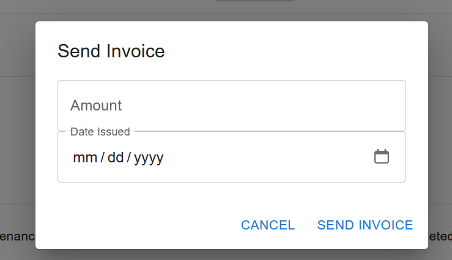

# Garage Management Application

Welcome to the Garage Management Application repository! This repository serves as the central hub to showcase the project, its architecture, and the services that make up this application. Each microservice, along with the frontend and deployment configurations, is stored in a separate repository.

---

## Table of Contents
- [Overview](#overview)
- [Domain Driven Design - DDD](#domain-driven-design)
- [Architecture](#architecture)
- [Screenshots](#screenshots)
- [Repositories](#repositories)

---

## Overview

The Garage Management Application is a modular, microservices-based application designed to streamline garage operations. It manages clients, vehicles, workshop tasks, invoices, and notifications. The system is designed with scalability, maintainability, and usability in mind.

Key features include:
- **Client Management**: Add, update, and manage customer information.
- **Vehicle Management**: Associate vehicles with clients and track their details.
- **Workshop Management**: Schedule and manage maintenance tasks for vehicles.
- **Invoices Management**: Generate and manage invoices for completed tasks.
- **Notification Service**: Send email notifications to clients regarding tasks and invoices.

---

##  Domain Driven Design

As part of the development process, we conducted an **event storming session** to model the system's domain, identify bounded contexts, and define the relationships between different components.

### Key Outputs:
- **Domain Model**: Identifies key entities like Clients, Vehicles, Workshops, Invoices, and Notifications.
- **Microservices Identification**: Maps each bounded context to a corresponding microservice.

---

## Architecture

The application is built using a microservices architecture. Here's an overview of the final architecture:

### Key Components
1. **Frontend**: A user-friendly interface built with React for managing the garage's operations.
2. **Gateway**: Acts as a single entry point, handling routing and load balancing.
3. **Microservices**:
   - **Clients Service**: Manages customer information.
   - **Vehicles Service**: Handles vehicle data associated with customers.
   - **Workshop Service**: Manages maintenance and repair tasks.
   - **Invoices Service**: Manages billing and invoicing.
   - **Notifications Service**: Sends email notifications asynchronously.

Communication between services:
- **Synchronous (REST)**: Used between the gateway, frontend, and services.
- **Asynchronous (RabbitMQ)**: Used for communication between the Workshop, Invoices, and Notifications services.

---

## Screenshots

### 1. Client Management
- **Client List**
  
- **Add New Client**
  

### 2. Vehicle Management
- **Vehicle List**
  
- **Add New Vehicle**
  

### 3. Workshop Management
- **Workshop and Task List**
  
  
- **Add Workshop** \
  
- **Schedule Task**
  

### 4. Invoices Interface
- **Invoice List**
  
- **Complete Task & Generate Invoice**
  

---

## Repositories

Here are the repositories for each microservice and component:

- [Clients Service Repository](https://github.com/HassanBouighamdane/garage-management-client-service)
- [Vehicles Service Repository](https://github.com/HassanBouighamdane/garage-management-vehicule-service)
- [Workshop Service Repository](https://github.com/mehdiboutoumit/garage-management-workshop-service)
- [Invoices Service Repository](https://github.com/HassanBouighamdane/garage-management-invoice-service)
- [Notifications Service Repository](https://github.com/mehdiboutoumit/garage-management-notification-service)
- [Gateway Service Repository](https://github.com/mehdiboutoumit/garage-management-gateway-service)
- [Frontend Repository](https://github.com/HassanBouighamdane/garage-management-frontend)
- [Kubernetes Deployment YAML Files Repository](https://github.com/HassanBouighamdane/garage-management-k8s)

---
## Collaborators

This project was made possible thanks to the efforts of the following contributors:

| Name                   | GitHub Profile                                  |
|------------------------|------------------------------------------------|
| Hassan Bouighamdane    | [GitHub Profile](https://github.com/HassanBouighamdane) |
| Boutoumit El Mehdi     | [GitHub Profile](https://github.com/mehdiboutoumit) |

We greatly appreciate the dedication and teamwork that went into building this application. If you'd like to contribute, feel free to reach out or fork the repositories!
